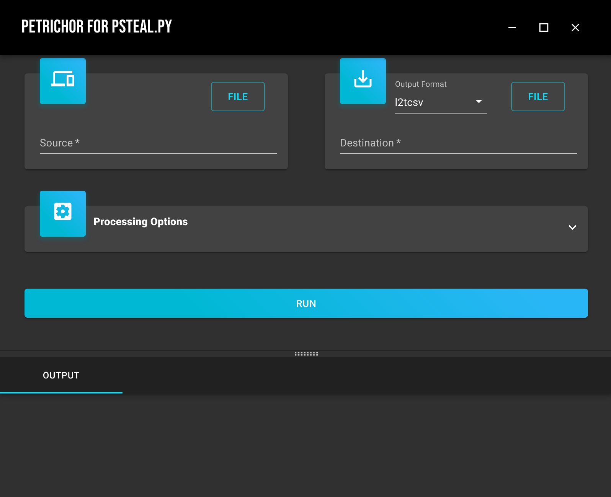

## Introduction
log2time.py and psort.py are very useful tools for timeline analysis. log2timeline.py can extract timestamps from various system and program artefacts. Subsequently, psort.py can process the timestamps gathered by log2timeline.py to export them in various formats.

psteal.py uses log2timeline.py and psort.py together to gather and process timestamps in one command. Petrichor for psteal.py is a graphic user interface for this tool.

This is an initial release. Although this program is functional, it doesn't support all psteal.py's functions yet. Use it as is. Please feel free to reach out to me if any bugs are found.

## Version
1.0.0

## Requirements
Plaso is not included in this program. Please install it prior using this program.

## Supported Operating Systems
* Ubuntu 18.04 x64 (tested)

It may work on other Linux distributions. However, testings are required to confirm them.

## SHA256
6f6d278213137d365f74e360ecd7f94cfd924c095761f603cb9c6e3b1bb97843  petrichor_1.0.0_amd64.deb

## Screenshot

